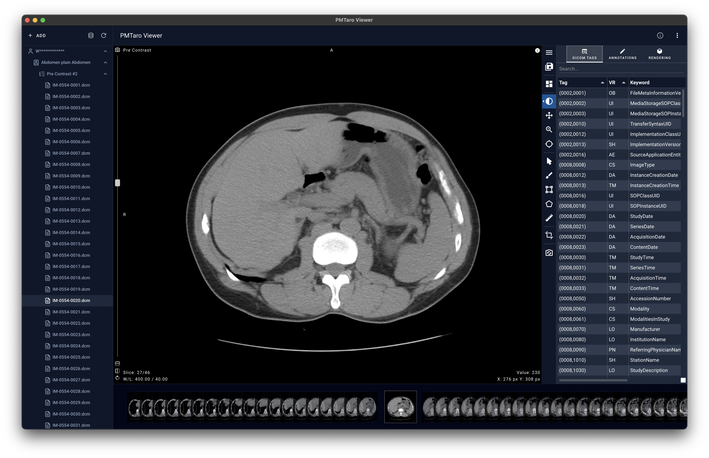

# PMTaro Viewer

A free, open-source desktop DICOM viewer based upon [VolView](https://github.com/Kitware/VolView) — with local file browsing, DICOM hierarchy management, thumbnail previews, and full offline support.

## Features

### 📂 Local File Browsing

Open any folder on your computer and the app will recursively scan for DICOM files. No uploading, no cloud, no internet — everything stays on your machine.

You can also switch to a **File Explorer** view to browse the raw folder structure alongside the parsed DICOM view.

### 🏥 Standard DICOM Hierarchy

DICOM files are automatically organized into the standard medical imaging hierarchy:

> **Patient / Study / Series / Instance**

Patient names, study descriptions, series numbers, and instance numbers are all extracted and displayed in a navigable tree.

### 🖼️ Thumbnail CoverFlow Preview

A horizontal thumbnail strip at the bottom of the screen shows rendered previews of every DICOM instance in the selected series. Click any thumbnail to instantly jump to that slice — or scroll through them to quickly browse an entire series.

### 🏷️ DICOM Tag Browser

A built-in DICOM Tag Browser right inside VolView's module panel. Select any slice and instantly view the full list of its DICOM tags.

### 🖥️ Cross-Platform

Available for **macOS** and **Windows**.

## Tech Stack

- **[VolView](https://github.com/Kitware/VolView)** — Kitware's open-source medical image viewer (embedded as a git submodule)
- **[Electron](https://www.electronjs.org/)** — Native desktop shell
- **[Nuxt](https://nuxt.com/)** — Vue.js framework powering the outer UI
- **[dcmjs](https://github.com/dcmjs-org/dcmjs)** / **[dcmjs-imaging](https://github.com/PantelisGeorgiadis/dcmjs-imaging)** — DICOM parsing and pixel decoding

## Contributing

Contributions are welcome! Feel free to open issues or submit pull requests.

## License

This project is licensed under the [MIT](LICENSE) license. Third-party components are listed in [THIRD-PARTY-NOTICES](THIRD-PARTY-NOTICES), including VolView under the Apache 2.0 license.

## Acknowledgments

This project would not be possible without the incredible work of the [Kitware](https://www.kitware.com/) team on [VolView](https://github.com/Kitware/VolView) and the broader open-source medical imaging community.
